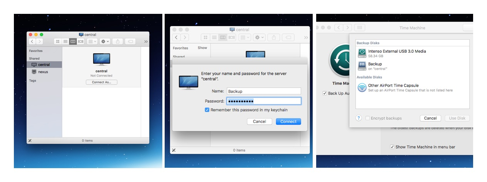

# docker-timemachine
A docker container to run a Time Machine server using SMB.

**Note:** This image is now using Samba as the network protocol. There is a AFP container available to use with old OSX versions. Check README in `afp` branch for more information.

**Coming from AFP?** We have an [upgrade guide](UPGRADE.md) to have you covered.

## Running on ARM / RPi
If you want to use this on an ARM-Device (like the Raspberry Pi), you have to compile it first:

```
$ docker build -t timemachine-rpi:latest -f Dockerfile .

$ docker run -h timemachine \
 --name timemachine \
 --restart=unless-stopped \
 -dit \
 -v /external_volume:/timemachine \
 -p 137:137/udp \
 -p 138:138/udp \
 -p 139:139/tcp \
 -p 445:445/tcp \
 timemachine-rpi
```

## Installation

### Step 1 - Start the Server

To download the docker container and execute it, simply run:

```
$ docker run -h timemachine \
 --name timemachine \
 --restart=unless-stopped \
 -dit \
 -v /external_volume:/timemachine \
 -p 137:137/udp \
 -p 138:138/udp \
 -p 139:139/tcp \
 -p 445:445/tcp \
 --ulimit nofile=65536:65536 \
 odarriba/timemachine
```

Replace `external_volume` with a local path where you want to store your data.

As the image has been started using the `--restart=always` flag, it will start when the computers boots up.


### Step 2 - Add a User

To add a user, run:

```
$ docker exec timemachine add-account USERNAME PASSWORD VOL_NAME VOL_ROOT
```

Or, if you want to add a user with a specific UID/GID, use the following format

```
$ docker exec timemachine add-account -i 1000 -g 1000 USERNAME PASSWORD VOL_NAME VOL_ROOT
```

But take care that:
* `VOL_NAME` will be the name of the volume shown on your OSX as the network drive
* `VOL_ROOT` should be an absolute path, preferably a sub-path of `/timemachine` (e.g., `/timemachine/backup`), so it will be stored in the according sub-path of your external volume.


### Step 3 - Enable Auto Discovery

Avahi daemon is commonly used to help your computers to find the services provided by a server.

Avahi isn't built into this Docker image because, due to Docker's networking limitations, Avahi can't spread it's messages to announce the services.

**If you want to enable this feature, you can install Avahi daemon on your host** following these steps (Ubuntu version):

* Install `avahi-daemon`: run `sudo apt-get install avahi-daemon avahi-utils`
* Copy the file from `avahi/nsswitch.conf` to `/etc/nsswitch.conf`
* Copy the service description file from `avahi/smbd.service` to `/etc/avahi/services/smbd.service`
* Restart Avahi's daemon: `sudo /etc/init.d/avahi-daemon restart`


### Step 4 - Configure Your Firewall

Make sure

* your server can receive traffic on the ports used by the container

* your Mac allows outgoing connections (Little Snitch?)


### Step 5 - Start Using It

To start using it, follow these steps:

* If you use Avahi, open **Finder**, go to **Shared** and connect to your server with your new username and password.

* Alternatively (or if you don't use Avahi) from **Finder** press **CMD-K** and type `smb://your-server` where `your-server` can be your server's name or IP address (e.g., `smb://my-server` or `smb://192.168.0.5`).

* Go to **System Preferences**, and open **Time Machine** settings.

* Open **Add or Remove Backup Disk...**

* Select your new volume.


In the example below, the Docker instance is running on server `central`. For `USERNAME` the account `Backup` along with a `PASSWORD` was created. Once connected, the account `Backup` is available in Time Machine settings:



## Advanced Usage

### Configure using environment variables

You can configure the container using environment variables (for example, if you use a `docker-compose` environment).

There are these environment variables:

* **SMB_LOGIN**: User name
* **SMB_PASSWORD**: User password
* **SMB_NAME**: Name of the volume
* **PUID**: For UID
* **PGID**: For GID

Using these variables, the container will create a user at boot time (only one per container) and **the data will be stored directly in the volume `/timemachine`, without subfolders**.

To find your `PUID` and `GUID` use `id user` as below:
```
    $ id <dockeruser>
       uid=1000(dockeruser) gid=1000(dockeruser)  groups=1000(dockergroup)
```

## FAQ


#### I got Docker running, my firewall is configured, but I still don't find the service in Time Machine.

Make sure you actually mount the server volume (see Step 5) before trying to find it in Time Machine settings.


### My container restarted and I can't login

The user accounts are ephemeral and you'll have to run `Step 2` again to re-create the accounts.
Alternativey, you can script the account creation and upload a custom entrypoint with the details:

```bash
#!/bin/bash
set -e

# Repeat for all your accounts
add-account USERNAME PASSWORD VOL_NAME VOL_ROOT
add-account USERNAME PASSWORD VOL_NAME VOL_ROOT
/usr/bin/supervisord -c /etc/supervisor/conf.d/supervisord.conf
```

Save the above file as `entrypoint.sh` and make sure it is marked as executable (`chmod +x entrypoint.sh`). Then invoke `docker run` as:

```
$ docker run -h timemachine \
 --name timemachine \
 --restart=unless-stopped \
 -dit \
 -v /external_volume:/timemachine \
 -p 137:137/udp \
 -p 138:138/udp \
 -p 139:139/tcp \
 -p 445:445/tcp \
 -v entrypoint.sh:/entrypoint.sh \
 odarriba/timemachine
```

#### I am still having trouble ...

* The idea of using avahi-daemon installed in the bare metal server is to avoid having to execute the container with --net=host, which a potentially insecure flag. But, as the last option to check things out, it should be fine. You just should know what you are enabling.

* A Time Machine network disk is just a disk image in an SMB volume that supports the correct level of encryption. So to be recognised by the Time Machine daemon, you should mount the unit manually for the first time, configure Time Machine on your computer, and then the OS will do that for you automatically.


#### Why do I need to install Avahi on your host and not in the container?

Because if you don't do it this way, the discovery message won't be able to reach your computers.


## Contributors

* Óscar de Arriba (odarriba@gmail.com)
* Daniel Iñigo (demil133@gmail.com)
* Josef Friedrich ([@Josef-Friedrich](https://github.com/Josef-Friedrich))
